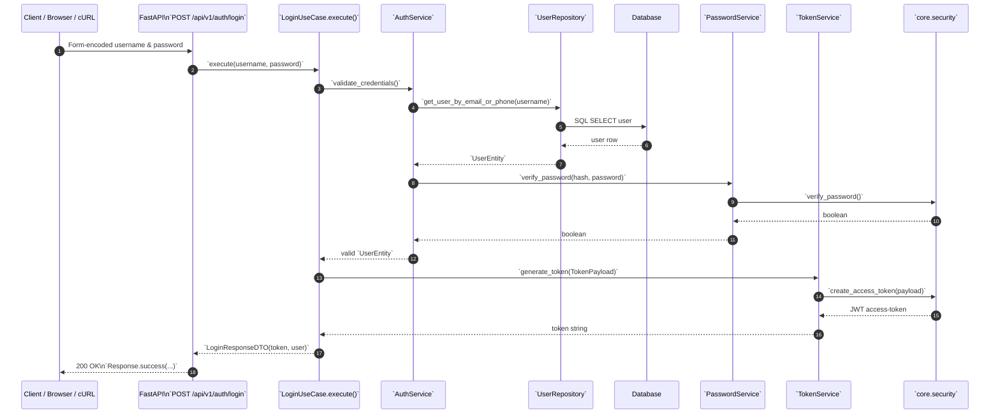

# Login API – Sequence Diagram

### Viewing the Diagram

GitHub now supports rendering Mermaid diagrams natively. After pushing this README to GitHub (or viewing it in any Markdown viewer with Mermaid support, such as the VS Code "Markdown Preview Mermaid Support" extension), you will see the diagram rendered automatically.

If you are using a Markdown viewer that does **not** support Mermaid, the fenced code will simply appear as text. In that case you can:

1. Copy the fenced diagram code above and paste it into the [Mermaid Live Editor](https://mermaid.live/).
2. Export SVG/PNG from the live editor and embed it as an image instead.
